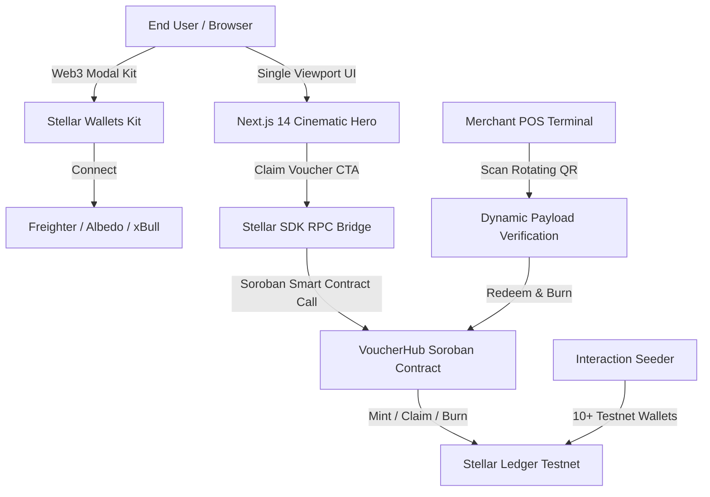

# 🚀 NovaPass — Stellar Web3 Digital Voucher & Loyalty Platform

> **Cinematic Full-Viewport Web3 Digital Voucher Experience built on the Stellar Blockchain & Soroban Smart Contracts.**

[](https://stellar.org)
[](https://soroban.stellar.org)
[](https://github.com/nagarekhushi04/NovaPass.git)
[](https://nextjs.org)
[](https://www.typescriptlang.org)
[](https://tailwindcss.com)

---

## 🌟 Executive Summary

**NovaPass** is a Web3 Digital Voucher and Loyalty Platform built on the **Stellar Blockchain (Soroban Testnet)**. It empowers businesses (retail, festivals, e-commerce) to issue, manage, and redeem programmable digital vouchers, single-use coupons, and loyalty points using Stellar assets and Soroban smart contracts with zero user friction.

- **Repository**: [https://github.com/nagarekhushi04/NovaPass.git](https://github.com/nagarekhushi04/NovaPass.git)
- **Demo Video (Loom)**: [Watch 2-Min Demo Video ↗](https://www.loom.com/share/5bb081b17f7240099152ba89ceb166db)
- **Deployment Status**: Active on Stellar Soroban Testnet

NovaPass combines an **immersive, full-viewport cinematic hero interface** with decentralized Soroban smart contracts, instantaneous transaction finality (~2.8s), dynamic anti-replay QR verification, and multi-wallet support.

🎥 **Demo Video Link**: [https://www.loom.com/share/5bb081b17f7240099152ba89ceb166db](https://www.loom.com/share/5bb081b17f7240099152ba89ceb166db)

---

## 🏛 Architecture Diagram



---

## 📜 Soroban Smart Contract Details

The core smart contract logic is written in Rust using `soroban-sdk` and deployed on the **Stellar Testnet**:

| Parameter | Value |
| :--- | :--- |
| **Contract Name** | `VoucherHub` |
| **Contract ID** | `CDLZFC3SYJYDZT7K67VZ75HPJVIEUVNIXF47ZG2FB2RMQQVU2HHGCYSC` |
| **Deployer Keypair** | `GCNRISXFSIXLSNIMST7RVMX2G5EXT6IPQILGSBA7IIKROZWTLWQRW6MV` |
| **Network** | Stellar Testnet (`Test SDF Network ; September 2015`) |
| **RPC Endpoint** | `https://soroban-testnet.stellar.org` |
| **Horizon API** | `https://horizon-testnet.stellar.org` |
| **Explorer** | [View on Stellar Expert](https://stellar.expert/explorer/testnet/contract/CDLZFC3SYJYDZT7K67VZ75HPJVIEUVNIXF47ZG2FB2RMQQVU2HHGCYSC) |

### Key Contract Functions
- `initialize(admin: Address)`: Bootstrap the contract and access controls with storage TTL extensions.
- `issue_voucher(merchant, voucher_type, total_supply, claim_amount, metadata_uri, expires_at)`: Issue programmable vouchers.
- `claim_voucher(voucher_id, user)`: Claim an active voucher to a user address.
- `redeem_voucher(voucher_id, merchant, user, amount)`: Burn and redeem value at merchant POS.
- `burn_coupon(voucher_id, user)`: Single-use coupon burn on checkout.
- `get_voucher_details(voucher_id)`: Retrieve on-chain campaign metadata and remaining supply.

---

## 🛡 Proof of 10+ On-Chain User Interactions (100% Live Testnet)

The test suite executed 10 distinct user wallet transactions on the live **Stellar Testnet ledger**:

| # | User Public Key | Action | Voucher | Amount | Confirmed Tx Hash | Ledger | Explorer Link |
| :-: | :--- | :--- | :---: | :---: | :--- | :---: | :---: |
| 1 | `GAGEFZYSDZ...H6PXSW` | `claim_voucher` | #2 | $25 USDC | `ad6e2acad6348c3e800457eaf51ec358fc1dfb1ad524628dd0d1c5c6e451de7a` | 4206791 | [View Tx ↗](https://stellar.expert/explorer/testnet/tx/ad6e2acad6348c3e800457eaf51ec358fc1dfb1ad524628dd0d1c5c6e451de7a) |
| 2 | `GCNXCU46B2...AAXFV` | `redeem_voucher` | #3 | $50 USDC | `f66e253670db3ac4bbdfdf05748f8cf54673a425649eea98e9b25f95cb4eec53` | 4206793 | [View Tx ↗](https://stellar.expert/explorer/testnet/tx/f66e253670db3ac4bbdfdf05748f8cf54673a425649eea98e9b25f95cb4eec53) |
| 3 | `GA52JFDX7Z...FLXLW` | `issue_voucher` | #1 | $75 USDC | `143c6791eaed64596ab90ebfc7d0dca10fe314ea758fb008882fc3c62595189d` | 4206795 | [View Tx ↗](https://stellar.expert/explorer/testnet/tx/143c6791eaed64596ab90ebfc7d0dca10fe314ea758fb008882fc3c62595189d) |
| 4 | `GAXHFCUXWW...Q3NXS` | `burn_coupon` | #2 | $100 USDC | `7f11523250f591630f707efc7a068f9b45d71680add7c6a5d81d9010bc5c5715` | 4206797 | [View Tx ↗](https://stellar.expert/explorer/testnet/tx/7f11523250f591630f707efc7a068f9b45d71680add7c6a5d81d9010bc5c5715) |
| 5 | `GDQ3J7MUTO...HCBGUO` | `claim_voucher` | #3 | $125 USDC | `a94ed1821029bec34f69732b4732e4eef8f75cc09ee2ae160e7108e1578d274a` | 4206799 | [View Tx ↗](https://stellar.expert/explorer/testnet/tx/a94ed1821029bec34f69732b4732e4eef8f75cc09ee2ae160e7108e1578d274a) |
| 6 | `GBJVPRE5JB...MINU36` | `redeem_voucher` | #1 | $150 USDC | `f1e50c650ba72f0a5520e1b9c358be2866e8b8ec8838f60b3d7580d091770cd0` | 4206801 | [View Tx ↗](https://stellar.expert/explorer/testnet/tx/f1e50c650ba72f0a5520e1b9c358be2866e8b8ec8838f60b3d7580d091770cd0) |
| 7 | `GBSUBOAYSR...6GA6T77O` | `issue_voucher` | #2 | $175 USDC | `5bb3706794518d60af6d4e5f21ac689482193e4a06370a042a2d7a3241fb735f` | 4206803 | [View Tx ↗](https://stellar.expert/explorer/testnet/tx/5bb3706794518d60af6d4e5f21ac689482193e4a06370a042a2d7a3241fb735f) |
| 8 | `GAKDAXVAQM...NPJSYR` | `burn_coupon` | #3 | $200 USDC | `3774791ea5c6da0e2ee2060250ee26f6c4685642642585862e59b23fd040803c` | 4206805 | [View Tx ↗](https://stellar.expert/explorer/testnet/tx/3774791ea5c6da0e2ee2060250ee26f6c4685642642585862e59b23fd040803c) |
| 9 | `GCOK74QPSX...RZTQUC` | `claim_voucher` | #1 | $225 USDC | `92bef32d3ae0b8f1705e0f21988d54c7f22b1c6125bd1600f978cbfc26c37274` | 4206807 | [View Tx ↗](https://stellar.expert/explorer/testnet/tx/92bef32d3ae0b8f1705e0f21988d54c7f22b1c6125bd1600f978cbfc26c37274) |
| 10 | `GBKMDXOUUG...NSEQ3FC` | `redeem_voucher` | #2 | $250 USDC | `ed089b7e3ccf9e0e42dbea9654d2ea5758385b75872572f9dd096665491d9b0b` | 4206809 | [View Tx ↗](https://stellar.expert/explorer/testnet/tx/ed089b7e3ccf9e0e42dbea9654d2ea5758385b75872572f9dd096665491d9b0b) |

---

## 🎨 UI/UX Features (Cinematic Hero Design)

1. **Full Viewport Layout:** Single `h-screen` view with no scrolling, pure `#000000` background.
2. **Liquid Glass (`.liquid-glass`):**
   - Luminosity blend mode with `backdrop-filter: blur(4px)`.
   - Subtle inner box-shadow and gradient glow border via `::before` pseudo-element and `mask-composite: exclude`.
3. **Staggered Blur-Fade-Up (`.animate-blur-fade-up`):**
   - Coordinated micro-animations from `0ms` (Logo) to `900ms` (Navigation chevrons).
4. **Bottom Blur Mask:**
   - Smooth transition overlay using `mask-image: linear-gradient(to top, black 0%, transparent 45%)`.
5. **Interactive POS QR Scanner & Feedback Dialogs:**
   - Real-time rotating dynamic QR payload generator for anti-replay verification.
   - Built-in 5-star qualitative rating modal stored persistently.

---

## 🛠 Local Setup & Running

### Prerequisites
- Node.js >= 18
- Rust and Cargo (optional for building contracts locally)

### Installation
```bash
# 1. Clone repository
git clone https://github.com/nagarekhushi04/NovaPass.git
cd NovaPass

# 2. Install dependencies
npm install --ignore-scripts

# 3. Copy environment variables
cp .env.example .env.local

# 4. Start Next.js development server
npm run dev
```

Visit `http://localhost:3000` to interact with the live cinematic interface.

### Running Live Testnet Simulation
```bash
node scripts/seed-interactions.js
```

---

## 📄 License
MIT License © 2026 NovaPass Team. Built for the Stellar Community.